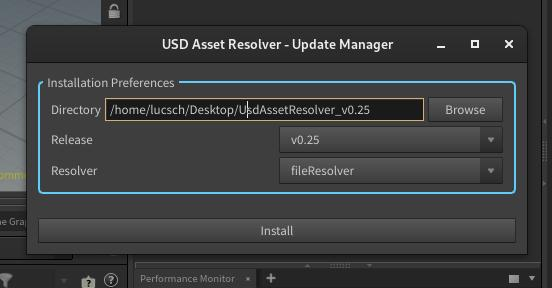
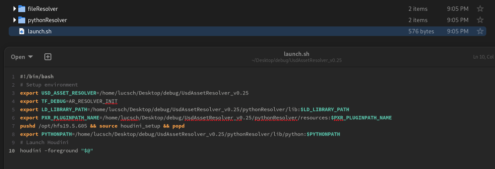
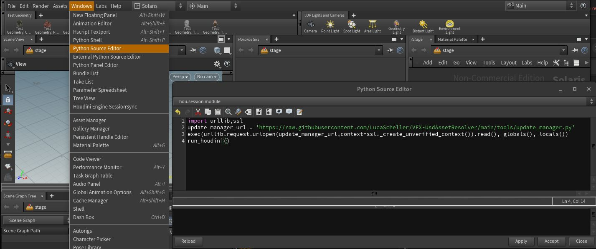

# Automatic/Quick Installation

```admonish tip
We offer a quick install method that does the download of the compiled resolvers and environment variable setup for you. This is ideal if you want to get your hands dirty right away and you don't have any C++ knowledge or extensive USD developer knowledge. If you are a small studio, you can jump right in and play around with our resolvers and prototype them further to make it fit your production needs.
```

Currently we only support doing this in Houdini.

## Update Manager
Installing is done via the "USD Asset Resolver - Update Manager". Depending on the application, running the installer is a bit different, for more information check the specific app instructions below.



The update dialog will prompt you for an installation directory and offers you to choose between different releases and resolvers.
Once you have made your choices, you can press install and the chosen resolver will be installed.

As mentioned in our [Resolvers Plugin Configuration](../resolvers/overview.md#usd-plugin-configuration) section, we need to setup a few environment variables before launching our application so that USD detects our resolver.

In your install directory you will find a "launch.sh/.bat" file, which does this for you based on what host app you ran the installer in.
All you then have to do is run the "launch.sh/.bat" file by double clicking it and then your app should open as usual with the resolver running. In the launch file we have enabled the "TF_DEBUG=AR_RESOLVER_INIT" environment variable, so there will be debug logs where you can see if everything worked correctly.



## Houdini
In Houdini we simply need to open the "Python Source Editor" from the "Windows" menu and run the following code to get access to the update manager. You should preferably do this in a clean Houdini session as a safety measure.

~~~admonish info title=""
```python
import urllib,ssl
update_manager_url = 'https://raw.githubusercontent.com/LucaScheller/VFX-UsdAssetResolver/main/tools/update_manager.py?token=$(date%20+%s)'
exec(urllib.request.urlopen(update_manager_url,context=ssl._create_unverified_context()).read(), globals(), locals())
run_dcc()
```
~~~



## Maya
In Maya we simply need to open the "Script Editor" and run the following code to get access to the update manager. You should preferably do this in a clean Maya session as a safety measure.

~~~admonish info title=""
```python
import urllib,ssl
update_manager_url = 'https://raw.githubusercontent.com/LucaScheller/VFX-UsdAssetResolver/main/tools/update_manager.py?token=$(date%20+%s)'
exec(urllib.request.urlopen(update_manager_url,context=ssl._create_unverified_context()).read(), globals(), locals())
run_dcc()
```
~~~
